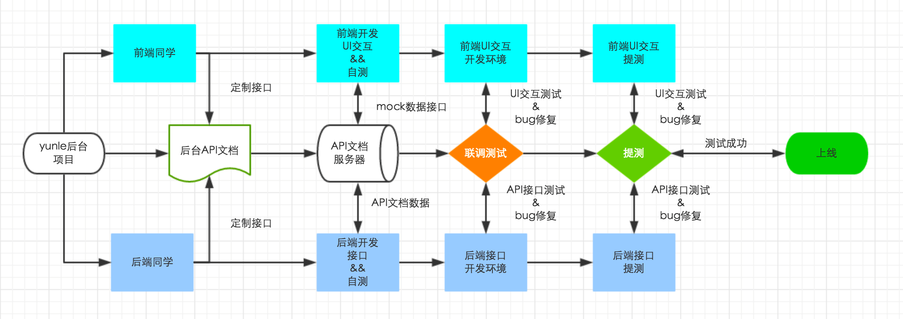

# yunle-template-electron

如使用该前端脚手架，可以先安装

1. `npm install -g yunle-cli`

2. `yunle init <project-name>`

3. `cd <project-name> && npm install`

4. `npm run dev`

## 开发流程



## 相关命令

> 开发过程中，你用得最多的会是`npm run dev`，但是这里还有很多其它的处理：


|`npm run <script>`|用途|
|------------------|-----------|
|`dev/build`|开发/生产环境 --- 启动服务。|

## 程序目录

```
.
├── .tmp                     # 开发临时文件
├── dist                     # 打包生产环境后文件
├── config                   # Server config
│   ├── server.config        # server
├── src                      # 应用源文件
│   ├── libs                 # 第三方库
│       ├── js               # 第三方js库
│       ├── css              # 第三方css库
│       ├── fonts            # 第三方fonts库
│       ├── ...              # 自定义
│   ├── styles               # 样式
│       ├── less             # less源文件
│   ├── images               # images源文件
│   ├── js                   # js源文件
│   ├── index.html           # html入口
├── test                     # 单元测试
```

## mockjs学习

[http://mockjs.com/](http://mockjs.com/)

## rap API文档工具学习

[http://rap.taobao.org/org/index.do](http://rap.taobao.org/org/index.do)
